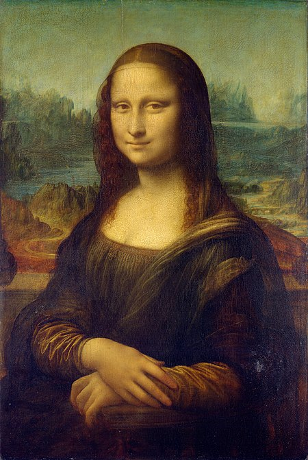
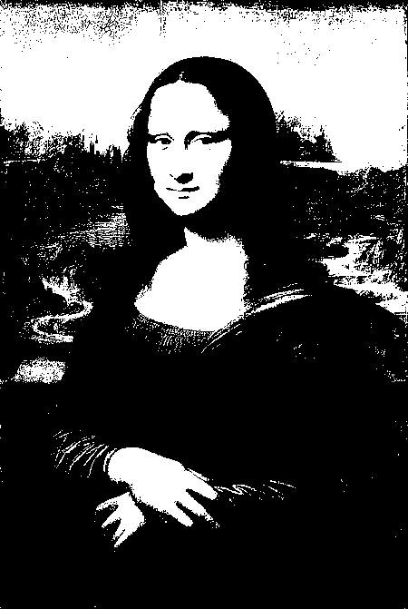
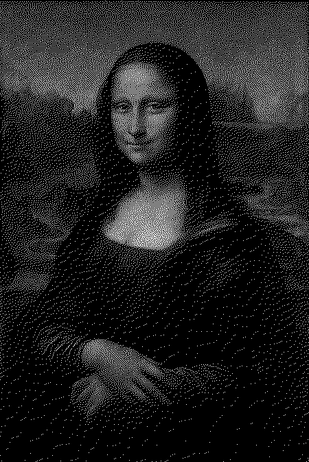
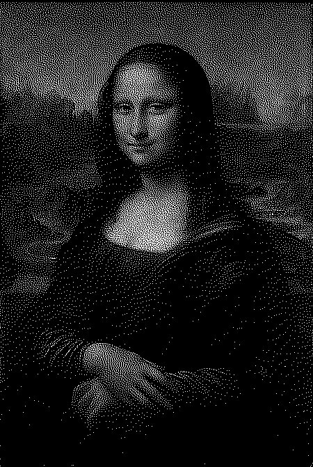

# Image to Black & White

Demo with Vue 2 to show loading an image and dithering to black and white. Has threshold, Bayer, Floyd Steinberg and Minimized Average Error dithering algorithms.

### Original  


### Threshold  


### Bayer (Ordered dithering)
A threshold technique where the threshold changes based on the value in an 8x8 array.  
https://en.wikipedia.org/wiki/Ordered_dithering  


### Floyd Steinberg  
Divides the error in pixel value into 16 parts and distributes  the error to 4 neighboring pixels.  
https://en.wikipedia.org/wiki/Floyd%E2%80%93Steinberg_dithering  


### Minimized Average Error  
Very similiar to Floyd Steinberg but uses a larger kernel (48 error parts among 12 neighboring pixels) which helps reduce stray pixels in black and white areas.  
https://en.wikipedia.org/wiki/Error_diffusion#minimized_average_error  


## Project setup
```
npm install
```

### Compiles and hot-reloads for development
```
npm run serve
```

### Compiles and minifies for production
```
npm run build
```

### Lints and fixes files
```
npm run lint
```

### Customize configuration
See [Configuration Reference](https://cli.vuejs.org/config/).


## MIT License

Copyright (c) 2021 Terry King

Permission is hereby granted, free of charge, to any person obtaining a copy
of this software and associated documentation files (the "Software"), to deal
in the Software without restriction, including without limitation the rights
to use, copy, modify, merge, publish, distribute, sublicense, and/or sell
copies of the Software, and to permit persons to whom the Software is
furnished to do so, subject to the following conditions:

The above copyright notice and this permission notice shall be included in all
copies or substantial portions of the Software.

THE SOFTWARE IS PROVIDED "AS IS", WITHOUT WARRANTY OF ANY KIND, EXPRESS OR
IMPLIED, INCLUDING BUT NOT LIMITED TO THE WARRANTIES OF MERCHANTABILITY,
FITNESS FOR A PARTICULAR PURPOSE AND NONINFRINGEMENT. IN NO EVENT SHALL THE
AUTHORS OR COPYRIGHT HOLDERS BE LIABLE FOR ANY CLAIM, DAMAGES OR OTHER
LIABILITY, WHETHER IN AN ACTION OF CONTRACT, TORT OR OTHERWISE, ARISING FROM,
OUT OF OR IN CONNECTION WITH THE SOFTWARE OR THE USE OR OTHER DEALINGS IN THE
SOFTWARE.